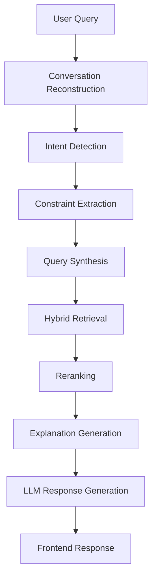

# SHL Conversational Assessment Recommendation System

AI-powered conversational recommendation engine for SHL assessments using conversational AI, retrieval orchestration, recruiter-style responses, conversational refinement, and grounded explainability.

---

## Live Demo

🚀 Deployed Application:  
https://nikitamittal123-shl-conversational-recommender.hf.space/

---

## Key Features

- Conversational SHL assessment recommendation
- Conversational refinement and follow-up queries
- Assessment comparison workflows
- Grounded explainability generation
- Conversational memory reconstruction
- Clarification handling
- Out-of-scope query rejection
- Recruiter-style natural responses
- Streamlit frontend + FastAPI backend

---

## Example Queries

```text
Need Python developer assessment
```

```text
Also include leadership evaluation
```

```text
Compare the first two assessments
```

```text
Explain why this assessment was recommended
```

---

## System Architecture



---

## Tech Stack

### Backend
- FastAPI
- Python

### Frontend
- Streamlit

### Retrieval
- BM25
- Retrieval orchestration

### Conversational AI
- Intent Routing
- Query Synthesis
- Constraint Extraction
- Dialog Policy Engine

### LLM
- Groq API
- Llama 3.1 8B Instant

---

## Repository Structure

```text
SHL/
├── api/
├── data/
├── frontend/
├── models/
├── requirements.txt
├── Dockerfile
└── README.md
```

---

## Core Capabilities

| Capability | Description |
|---|---|
| Recommendation | Recommends SHL assessments conversationally |
| Refinement | Supports iterative recommendation refinement |
| Explainability | Explains recommendation reasoning |
| Comparison | Compares assessments conversationally |
| QA | Answers catalog-grounded questions |
| Rejection | Rejects unrelated/out-of-scope queries |

---

## Deployment

Frontend Deployment:  
https://nikitamittal123-shl-conversational-recommender.hf.space/

GitHub Repository:  
https://github.com/mittalnikita/shl-conversational-recommender

---

## Future Improvements

- Ontology-based normalization
- Stronger semantic reranking
- Multilingual support
- Recruiter analytics dashboard
- Advanced conversational planning

---

## Conclusion

This project demonstrates a modular conversational AI system for SHL assessment recommendation using conversational orchestration, retrieval engineering, grounded explainability, and recruiter-style interaction workflows.
